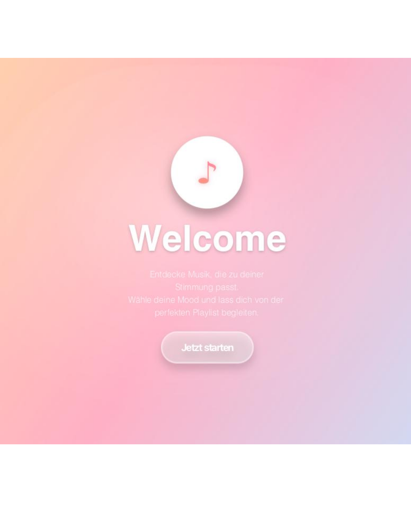

# MoodPlayer

Ein JavaFX-basierter Musikplayer, der Songs nach emotionalen Stimmungen filtert für ein personalisiertes Hörerlebnis.

Dieses Projekt wurde im Rahmes des Hochschulmoduls "Entwicklung interaktiver Benutzeroberflächen" an der Hochschule RheinMain erstellt.


*Hauptansicht mit stimmungsbasierter Filterung*

## Features

- **Mood-basierte Filterung**: Auswahl aus 12 emotionalen Moods 
- **Live Playback-Visualisierung**: rotierende Vinyl-Animation synchron zum Wiedergabestatus
- **dynamische Hintergründe**: animierte Lava-Hintergründe mit Mood-abhängigen Farben
- **organische Mood-Auswahl**: physikbasierte Kollisionserkennung für natürliche Anordnung
- **Echtzeit-Updates**: Live Positions-Tracking mit flüssigen UI-Updates (1000ms Intervalle)


## Screenshots

### Start-Ansicht


### Mood-Ansicht


### Playlist-Ansicht


### Player-Ansicht


## Technologien

- **Sprache**: Java 17
- **UI Framework**: JavaFX 21
- **Audio-Bibliothek**: Minim (für MP3-Wiedergabe)
- **Build-Tool**: Maven


## Installation & Start

### Voraussetzungen
1. **Repository klonen**
```
    bash
    git clone https://github.com/angelina-alpermannmahr/moodplayer.git
    cd moodplayer
```

2. **Projekt bauen**
```
    bash
    mvn clean install
```

3. **Anwendung starten**
```
    bash
    mvn javafx:run
```


